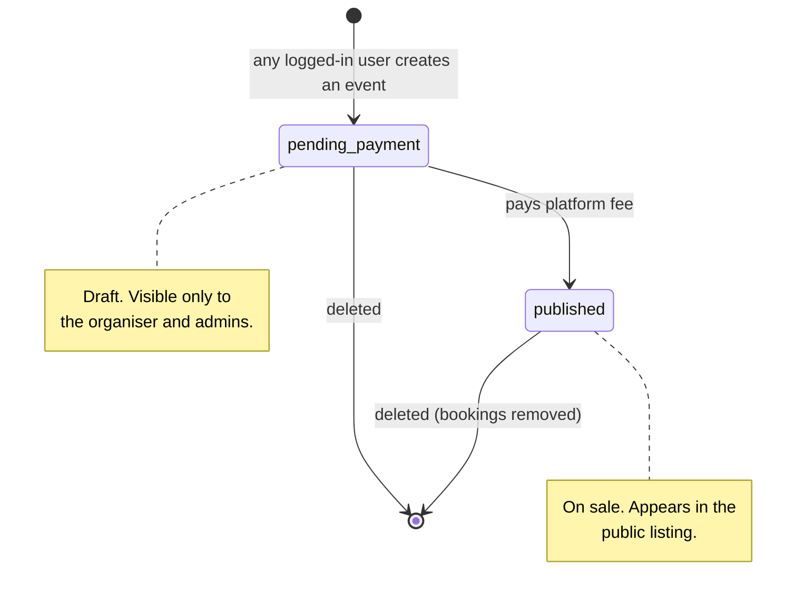
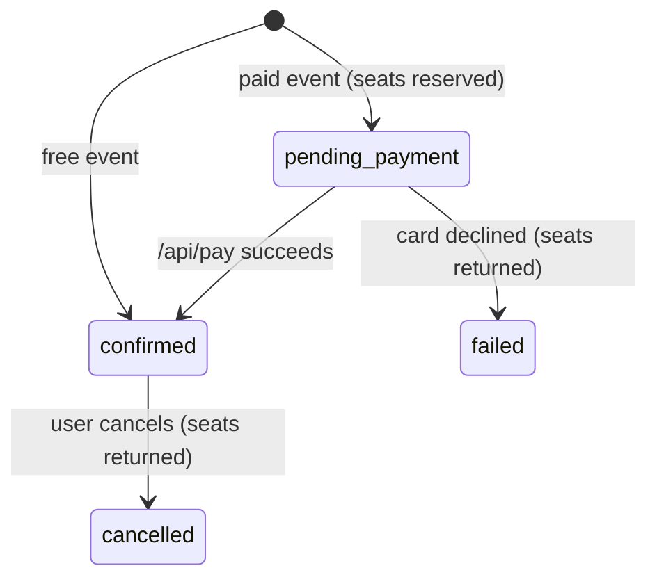

# Event Khujo

Event discovery and production budgeting for Bangladesh — find concerts, book
tickets, and price a full show (venue + lineup + sponsorship) before you commit
to it.

Built with Flask and vanilla ES modules. No build step, no bundler, no npm.

---

## Quick start

```bash
uv run python server.py
# → http://localhost:9000
```

Default admin account: `admin` / `admin123` — **change this before deploying.**

### Configuration

Everything is environment-driven, with sensible defaults:

| Variable | Default | Purpose |
|---|---|---|
| `SECRET_KEY` | dev value | Flask session signing — set this in production |
| `DATABASE` | `events.db` | SQLite file path |
| `PW_SALT` | dev value | Password hashing salt |
| `PLATFORM_FEE` | `50000` | One-time fee to publish an event (BDT) |
| `HOST` / `PORT` | `0.0.0.0` / `9000` | Bind address |
| `FLASK_DEBUG` | `0` | Set to `1` for the reloader |

Production:

```bash
gunicorn "app:create_app()" --bind 0.0.0.0:9000
```

---

## How it works

### Event lifecycle



### Ticket lifecycle

Seats are **reserved at booking time** and released again on failure or
cancellation, so the remaining count is always honest.



### The pricing formula

```
Total Expenses = Venue Fee
               + Σ(Selected Artist Fees)
               + Organizer Costs
               + Platform Margin

Net Expense    = Total Expenses − Sponsorship

Base Ticket    = Net Expense ÷ Venue Capacity
```

This lives in `app/pricing.py` as **pure functions with no Flask or database
imports**, so it can be unit-tested directly and reused by a CLI or export tool.

> **Worked example.** Army Stadium (৳200,000) with Nagarbaul James (৳2,000,000)
> and Miles (৳500,000), plus ৳100,000 organizer costs and a ৳100,000 margin,
> against ৳300,000 sponsorship at 20,000 capacity:
>
> `(200,000 + 2,500,000 + 100,000 + 100,000 − 300,000) ÷ 20,000 = ৳130.00`

The frontend mirrors this arithmetic in `components/budgetPanel.js` for live
feedback while typing, but **the server is always authoritative** — it
recomputes on save and ignores any price the client claims.

---

## Architecture

```
app/
├── __init__.py          create_app() factory, config, blueprint wiring
├── db.py                connection handling, schema, migrations, seed data
├── auth.py              password hashing + login_required / admin_required
├── pricing.py           pure budget math (no framework imports)
├── serializers.py       row → JSON shaping, shared by all blueprints
└── routes/
    ├── auth.py          csrf, register, login, logout, profile
    ├── venues.py        venue CRUD        (public read, admin write)
    ├── artists.py       artist CRUD       (public read, admin write)
    ├── events.py        event CRUD, /quote, /publish
    ├── bookings.py      book, pay, list, cancel
    └── admin.py         stats, settings, CSV export

static/
├── css/
│   ├── header.css       header, account chip, avatars
│   └── production.css   budget panel, artist picker, tiers, tables
├── js/
│   ├── main.js          entry point — registers routes, boots the app
│   ├── api.js           fetch wrapper + global store
│   ├── router.js        hash router
│   ├── nav.js           header nav + account chip + search
│   ├── ui.js            toast + confirm modal
│   ├── utils.js         formatting, escaping, shared fragments
│   ├── components/
│   │   ├── budgetPanel.js    live budget, talks to /api/events/quote
│   │   ├── artistPicker.js   searchable multi-select lineup
│   │   └── tierEditor.js     dynamic VIP / Student / … rows
│   └── views/           one module per screen
└── style.css            design tokens, base elements, layout
```

### Design principles

- **One responsibility per module.** Views render; components compute; the
  router routes.
- **Server owns the money.** Client-side pricing is a convenience preview only.
- **Migrations are idempotent.** `init_db()` runs on every boot and only adds
  what's missing. SQLite forbids non-constant `ALTER TABLE` defaults, so
  timestamp columns are added bare and backfilled.
- **Soft-delete reference data.** A venue or artist attached to an event is
  hidden, never removed, so historical budgets stay accurate.
- **Escape everything.** All user text passes through `esc()` before reaching
  `innerHTML`.

---

## API

| Method | Endpoint | Auth | Purpose |
|---|---|---|---|
| `GET` | `/api/csrf` | — | Fetch CSRF token |
| `POST` | `/api/register` | — | Create account |
| `POST` | `/api/login` | — | Sign in |
| `POST` | `/api/logout` | user | Sign out |
| `GET` | `/api/me` | — | Current user or `{logged_in:false}` |
| `PUT` | `/api/profile` | user | Update profile fields |
| `POST` | `/api/change-password` | user | Change password |
| `GET` | `/api/events` | — | List published events (`?mine=1` for own drafts) |
| `GET` | `/api/events/:id` | — | Event detail + lineup + tiers + budget |
| `POST` | `/api/events` | user | Create event (starts as draft) |
| `PUT` | `/api/events/:id` | owner/admin | Update event |
| `DELETE` | `/api/events/:id` | owner/admin | Delete event |
| `POST` | `/api/events/quote` | — | Budget preview (no writes) |
| `POST` | `/api/events/:id/publish` | owner/admin | Pay platform fee → go live |
| `GET` | `/api/venues` · `/api/artists` | — | Reference data |
| `POST/PUT/DELETE` | `/api/venues/:id` · `/api/artists/:id` | admin | Manage reference data |
| `POST` | `/api/book` | user | Reserve tickets |
| `POST` | `/api/pay` | user | Confirm payment |
| `GET` | `/api/bookings` | user | My bookings |
| `DELETE` | `/api/bookings/:id` | user | Cancel booking |
| `GET` | `/api/admin/stats` | admin | Dashboard figures |
| `GET` | `/api/admin/export-bookings` | admin | Bookings as CSV |

All mutating requests require an `X-CSRF-Token` header matching the session token.

---

## Payments

Both the ticket checkout and the platform fee run in **demo mode**:

- Visa (`4…`) and Mastercard (`5…`) are accepted
- Any card ending `0000` is declined, so the failure path stays testable
- Mobile wallets (bKash / Nagad) simulate an OTP

Swap the marked block in `routes/events.py::publish_event` and
`routes/bookings.py::pay` for a real gateway call — the surrounding logic
(reservations, rollback, transactions) stays unchanged.

---

## Seeded reference data

Eight venues (Bangladesh Army Stadium, Sher-e-Bangla, ICCB, Senakunja, Pan
Pacific Sonargaon, …) and thirty-two artists (Nagarbaul James, Miles, Warfaze,
Arbovirus, …) are seeded on first boot with their real capacities and fees.
Both are fully editable from the Admin panel afterwards.

